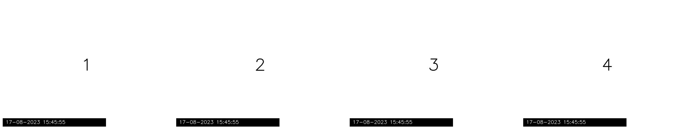

# Vison based quality control system

The system utilizes Mask R-CNN to detect blocks of material attached to a robotic arm and then crops these blocks to estimate the blocks's quality based on specific characteristics on the surface. Multiple cameras are synchronized to capture frames, which are subsequently combined to generate an overall score for each block on the production line.

## System Overview

### Architecture 
The whole system based on multiples servcies that handle different aspect of the procces. The system uses the commonly used high scalable KAFKA broker and the Mask-RCNN for object detection.

Overview of the architecture:

Every service will analyzed in the following subsections.
### Stream Recorder

The stream recorder service, known as stream_producer, is tasked with capturing RTSP streams from sources in real-time and automatically converting them into messages on the KAFKA broker. This service is crucial as it guarantees zero frame loss from the source. It's essential to deploy this service in correspondence with the number of sources, ensuring that each replica can monitor and transmit data for its respective source.

### Indexing 

Every video source transmits images without any supplemental information, such as frame ID or timestamp. Additionally, due to network performance or the nature of the RTSP protocol, there can be delays, ensuring that we never have synchronized video streams. To address this challenge, we introduced the timestamp_extractor service.

This service is tasked with extracting the timestamp information embedded within each frame. This timestamp is imprinted on the lower left corner of every frame in text format. To extract the timestamp, we initially perform a cropping action using OpenCV. Within this cropped area, Optical Character Recognition (OCR) is executed using PyTesseract. The cropping step is crucial as it helps eliminate any non-relevant information from the frame, focusing solely on the timestamp.

We have deployed four replicas of this service, one dedicated to each source. As input, these replicas use the output topic from the stream_producer services. In the end, each service creates a new JSON packet encompassing the timestamp, the source name, and the image, transmitting the packets to a shared topic.

### Synchronization

The most critical task in the entire process is synchronizing the frames to ascertain which object is being assessed. This service, known as the synchronizer, processes all the indexed frames from the timestamp_extractor services and then creates four queues for every source. Whenever a new packet arrives, the service automatically appends the frame to the queue corresponding to its source. The subsequent step is to inspect the last element of every queue and determine which timestamp is the earliest. Using the earliest timestamp, the service dequeues (pop operation) the other queues to ensure synchronization of the last element in each queue. In our application, timestamps are recorded at a frequency of one per second, so the service aims to synchronize every frame to the exact second. Once synchronization is achieved, the service constructs a new JSON packet containing the source names, the timestamp, and a list of the synchronized frames. This packet is then transmitted to a topic on the KAFKA broker.

Queue Mechanism

### Quality Estimation

The final service is the estimator. The estimator has the task of receiving the packets from the synchronizer and performing object detection with masks for every frame from the four sources. Detection is performed using a custom-trained Mask-RCNN model, specifically trained for this task using transfer learning. From there, we select the masks with the highest scores (based on the threshold) and perform a specialized crop, retaining only the area of interest. Subsequently, we take these areas and conduct blob detection using an OpenCV blob detector calibrated for the specific images to count and measure the area of each blob. In the final step, we calculate the total area of the mask and the total area of all the blobs, and then compute the coverage percentage of impurities based on the area of the mask. The combined coverage percentage from all sources provides us with the overall quality of the object.

## Usage
## Dummy streamer
Within the dummy_streamer directory, there's a Docker Compose configuration that automatically initiates 4 RTSP streams accessible via rtsp://localhost:8554/stream1..4. This setup proves invaluable for development and testing purposes.

## For developing

Follow the development guidelines detailed in [INSTALL.md](/INSTALL.md).

## For testing

1.Follow the deployment instructions found in [INSTALL.md](/INSTALL.md).

2. Launch the dummy streamer.

2. From the root directory, execute the Docker Compose configuration.

Please note: This Docker Compose setup presumes the presence of an Nvidia Graphics card and CUDA version 11.8 on your system. If your setup deviates from this, modify the Dockerfile of the estimator and the docker-compose.yml in the root directory to align with your system's specifications.